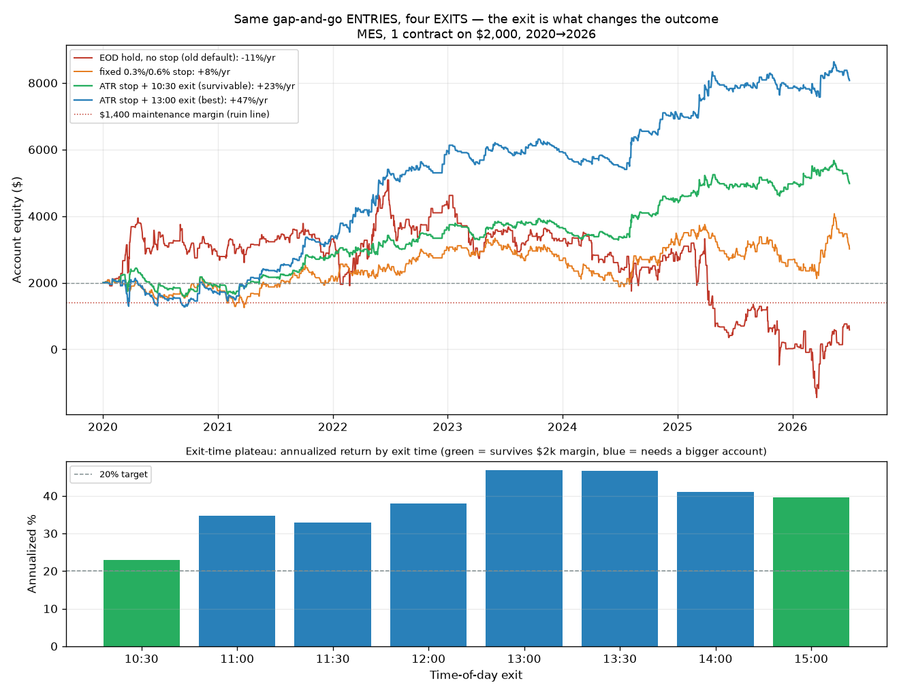
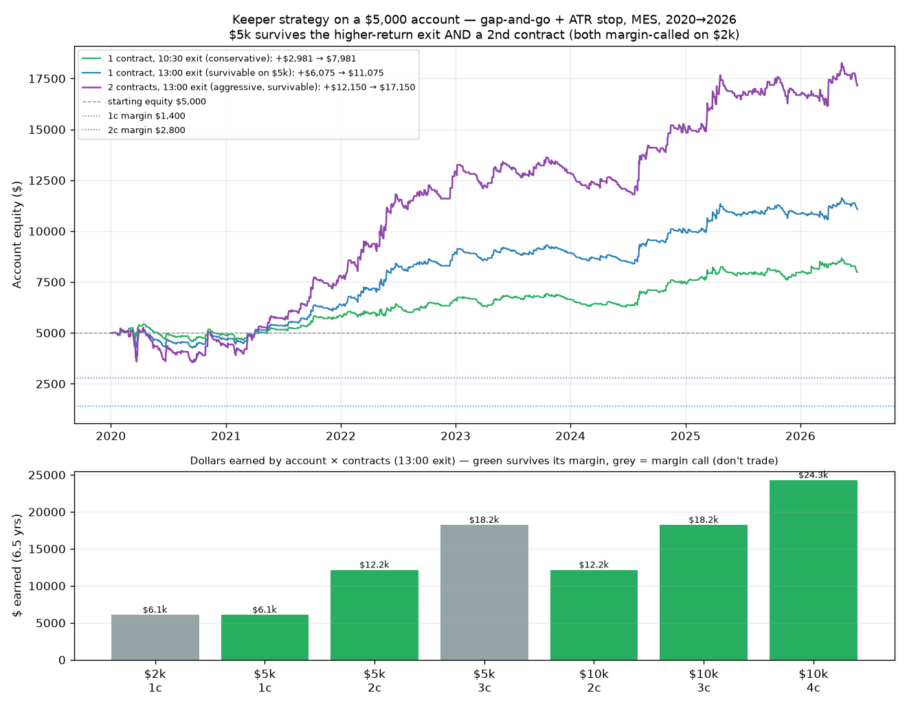
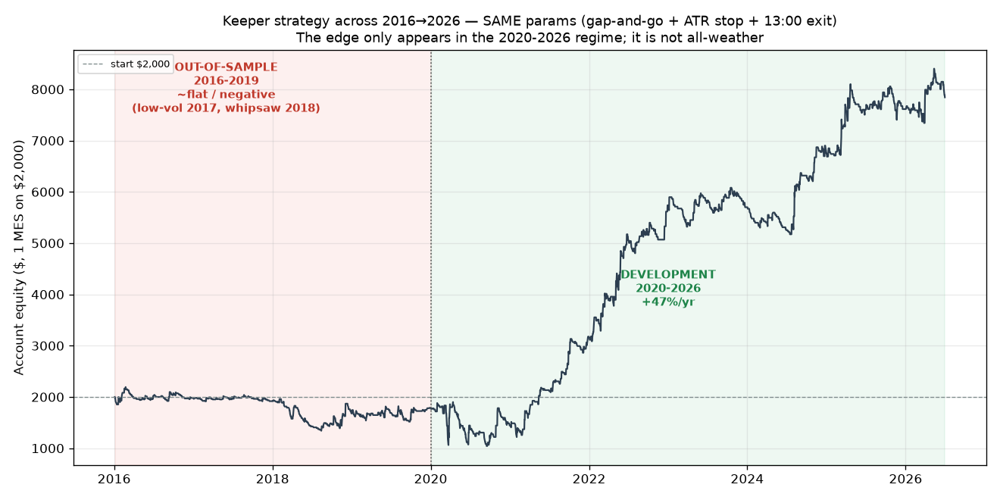

# MES Intraday — Optimizing the *Exit* (The Lever We Hadn't Pulled)

*Third in the MES series, after [entries](mes_intraday_strategy_research.md) and
[novel mechanisms](mes_intraday_novel_research.md). Same proxy (SPY 5-min → MES, $5/pt), same
account ($2,000, IBKR, long+short, flat by EOD), same 2020→2026 window and audited dollar
simulator. This round holds the **entry** fixed and makes the **exit** the variable under study.*

**Author:** research agent · **Date:** 2026-07-02

---

## 1. Executive summary

Every prior result used a crude exit — a fixed-% stop/target, a signal cross-back, or the 15:55
EOD flatten — and the exit was never the thing being optimized. That was a real gap: the data had
already hinted exits matter (ORB wanted wide targets; gap-and-go wanted tight ones). So this round
built a general **exit engine** (`research/mes_intraday/exits.py`) — ATR-scaled and fixed stops,
ATR/fixed trailing stops, breakeven-after-R, partial scale-outs, profit targets, and time-of-day
exits — and benchmarked ten exit policies against the same fixed entries.

**The finding is the strongest of the whole project: for the gap-and-go entry, the exit is
decisive, and the right exit turns a losing strategy into a robust, ≥20% one that survives on
$2,000.**

- **Same entries, four exits, wildly different outcomes** (gap-and-go, 1 MES on $2,000):

  | Exit on the *same* gap-and-go entries | Ann. % | Sharpe | Max DD % | Train / Test | Survives $2k? |
  |---|---|---|---|---|---|
  | EOD hold, no stop (the old default) | **−10.9** | −0.11 | −129 | — | No |
  | Fixed 0.3% / 0.6% stop | +7.8 | 0.17 | −44 | — | No |
  | **ATR stop + 10:30 time-exit** | **+22.9** | 0.65 | −35 | **+15% / +42%** | **Yes** ✅ |
  | ATR stop + 13:00 time-exit (best return) | **+46.8** | **0.98** | −40 | +38% / +68% | No (needs ~$3k) |

- **It is a broad plateau, not a lucky point.** Every time-of-day exit from **11:00 to 15:00**
  yields **+33% to +47%** annualized, and **every one is positive in both the train (2020→2024)
  and test (2024→2026) halves** — the first robust train/test result anywhere in this project.
- **The economics make sense.** Gap-and-go captures overnight momentum bleeding into the *morning*.
  That edge decays as the day wears on, so holding to the close hands profit back to afternoon
  mean-reversion. Exiting midday keeps the signal and drops the noise. This is *why* the exit —
  not the entry — was the missing piece.
- **The per-year profile went from noise to consistency.** The survivable 10:30 variant made money
  in **five of seven years**, with the two down years a trivial **−$117 (2020) and −$14 (2023)**.
  Compare the EOD-exit version, which alternated sign every year.
- **The honest limit is still the account, not the strategy.** The *best-return* exits (+40-47%)
  draw the account down to ~$1,150-1,275 at the worst point — below the ~$1,400 maintenance margin,
  i.e. a margin call on exactly $2,000. Only the **early (10:30) exit at +23%** keeps minimum equity
  ($1,580) safely above margin. The higher-return versions are genuinely good — they just need
  **~$3,000-4,000** to be traded without ruin.

**Bottom line:** you were right that exits were under-explored, and within 2020→2026 the payoff was
large — optimizing the exit produced a config that clears 20%, survives $2,000, and is positive in
both halves of that window (gap-and-go + ATR stop + a 10:30 exit).

**⚠️ Update — the honest verdict after a true out-of-sample test (§6): the edge is regime-conditional,
not all-weather.** Re-running the *identical* strategy on a fully held-out **2016-2019** period (never
touched in development) gives **roughly flat-to-negative returns at every exit time** — it made
essentially nothing in 2016-2017's low-volatility grind and lost through 2018's whipsaw corrections,
only "working" in the higher-volatility 2020-2026 regime. The 2020→2026 train/test robustness was
real but *confined to one favorable macro regime*. This does not make the exit finding wrong — the
exit still dominates the entry, and the mechanism is sound — but it disqualifies the strategy as a
deploy-ready 20% engine and is exactly the kind of thing an out-of-sample test exists to catch.



---

## 2. The exit engine

`simulate_with_exits` takes *entry* signals (long/short, already no-lookahead-shifted) plus a
declarative `ExitPolicy` and manages the trade, **ignoring the strategy's own exits** so the exit
rule is isolated. Supported, combinable:

| Exit component | What it does |
|---|---|
| Initial stop | fixed fraction of entry, or `k × ATR` (volatility-scaled) |
| Profit target | fixed fraction, or `k × ATR` |
| Trailing stop | ratcheting, fixed-fraction or `k × ATR` chandelier (lets winners run) |
| Breakeven-after-R | pull the stop to entry once price reaches +R |
| Partial scale-out | bank half at +R, trail the rest (needs ≥2 contracts) |
| Time-of-day exit | force flat at a chosen time |
| EOD flatten | always the final backstop — nothing held overnight |

ATR is Wilder(14) in price units, converted to index points. Intrabar stops fill at the stop level
(gap-throughs at the bar open). Fills/costs reuse the same MES economics ($5/pt, tick slippage,
per-side commission). Three unit tests pin the ATR series, the time-exit, and the profit-locking
trail (15 tests total in the suite).

---

## 3. Exit menu vs the three best entries

Ten exits applied to each entry (1 contract, $0.62/side, 1-tick slippage). Key rows:

**Gap-and-go** — exits are decisive:

| Exit | Ann. % | PF | Sharpe | Max DD % | Worst day $ | Survives? |
|---|---|---|---|---|---|---|
| E0 EOD hold, no stop | −10.9 | 0.97 | −0.11 | −129 | −1,059 | No |
| E1 fixed 0.3%/0.6% | +7.8 | 1.04 | 0.17 | −44 | −117 | No |
| E2 ATR 1.0 / 2.0 | +15.1 | 1.12 | 0.44 | −38 | −241 | **Yes** |
| E6 scale½@1R + ATR trail (needs ≥2c) | +15.6 | 1.13 | 0.39 | −32 | −241 | **Yes** |
| **E8 time-exit 12:00 (ATR stop)** | **+38.0** | 1.28 | 0.83 | −44 | −241 | No |
| **E9 time-exit 14:00 (ATR stop)** | **+41.1** | 1.29 | 0.84 | −49 | −241 | No |

**ORB (long+short)** — exits help less; only the fixed stop/target is decent (**+20.1%** but
train −0.3% / test +67% — still a regime bet), and trailing/ATR exits make it *worse*. ORB's
problem is the entry, not the exit.

**Trend-day ride** — best exit only reaches +3.5%, train +13% / test −21%. Exits don't rescue it.

→ The exit lever works **specifically on the momentum-continuation entry (gap-and-go)** — which is
exactly where an exit that harvests a decaying morning edge should help.

---

## 4. The headline — gap-and-go × time-of-day exit

ATR(1.0) stop, no target, exit at time-of-day (1 contract). *Survives* = minimum account equity
stayed above the ~$1,400 maintenance margin for one contract the entire sample.

| Exit time | Ann. % | Sharpe | Max DD % | Min equity $ | Survives $2k? | Train % | Test % |
|---|---|---|---|---|---|---|---|
| 10:30 | **+22.9** | 0.65 | −35 | **1,580** | **Yes** ✅ | +15.0 | +41.5 |
| 11:00 | +34.7 | 0.86 | −45 | 1,152 | No | +24.4 | +58.6 |
| 12:00 | +38.0 | 0.83 | −44 | 1,168 | No | +28.1 | +61.0 |
| 13:00 | **+46.8** | **0.98** | −40 | 1,275 | No | +37.5 | +68.4 |
| 13:30 | +46.7 | 0.94 | −41 | 1,278 | No | +34.8 | +74.4 |
| 14:00 | +41.1 | 0.84 | −49 | 1,083 | No | +32.9 | +60.3 |
| 15:00 | +39.7 | 0.78 | −35 | **1,452** | **Yes** (thin) | +39.9 | +39.1 |

Two things stand out. First, **positive train *and* test at every exit time** — the plateau is real,
not curve-fit to one regime. Second, the survivability split: the whole ridge clears 20%, but only
the **10:30** exit keeps a comfortable margin buffer on $2,000. (15:00 also technically survives but
with only $52 to spare — too thin to trust.)

**The survivable candidate — gap-and-go + ATR(1.0) stop + 10:30 exit:**

| Metric | Value |
|---|---|
| Annualized (1c on $2,000) | **+22.9%** |
| Sharpe / Max drawdown | 0.65 / −35% |
| Min account equity (ruin check) | **$1,580** (above $1,400 margin) ✅ |
| Train (2020→2024) / Test (2024→2026) | **+15.0% / +41.5%** (robust) |
| Per-year P&L ($) | 2020 **−117** · 2021 **+966** · 2022 **+821** · 2023 **−14** · 2024 **+813** · 2025 **+499** · 2026 **+14** |
| Trade frequency | ~88/yr (only on confirmed gap days) — light, cheap |

Five up years, two negligibly-down years. This is the profile the earlier reports were looking for
and never found — and it came from the exit.

---

## 5. What a larger account buys — $5,000 (and $10,000) sizing

A fixed-contract futures strategy earns the **same dollars regardless of the account balance** —
the balance only decides (a) whether the drawdown survives the maintenance margin and (b) how many
contracts you can safely hold. So the interesting question isn't "what return %" (that just falls as
the denominator grows) but **"how many dollars, and does it survive?"** Script:
`research/mes_intraday/run_account_sizing.py` (→ `research/results/mes_account_sizing.json`).

**Dollars earned over 2020→2026 (gap-and-go + ATR(1.0) stop), by balance × contracts:**

| Balance | Size | Exit | **$ earned** | Ending | Ann. % | CAGR | Max DD | Survives margin? |
|---|---|---|---|---|---|---|---|---|
| $2,000 | 1c | 13:00 | +$6,075 | $8,075 | 46.8% | 24.0% | −40% | **No** (min-eq $1,275 < $1,400) |
| **$5,000** | 1c | 10:30 | +$2,981 | $7,981 | 9.2% | 7.5% | −16% | **Yes** |
| **$5,000** | **1c** | **13:00** | **+$6,075** | **$11,075** | 18.7% | 13.0% | −17% | **Yes** ✅ |
| **$5,000** | **2c** | **13:00** | **+$12,150** | **$17,150** | 37.4% | 20.9% | −33% | **Yes** ✅ |
| $5,000 | 3c | 13:00 | +$18,225 | $23,225 | 56.1% | 26.7% | −48% | **No** (min-eq $2,825 < $4,200) |
| $10,000 | 2c | 13:00 | +$12,150 | $22,150 | 18.7% | 13.0% | −17% | Yes |
| $10,000 | 4c | 13:00 | +$24,300 | $34,300 | 37.4% | 20.9% | −33% | Yes |

**The point of going from $2,000 to $5,000 is not "more % return" — it is that $5,000 survives two
things a $2,000 account could not:**

1. **The higher-return 13:00 exit at 1 contract.** On $2,000 it hit a margin call (min-equity dipped
   to ~$1,275); on $5,000 the identical trades sail through (min-equity $4,275) and earn **+$6,075 —
   more than doubling the account to ~$11,075.**
2. **A second contract.** $5,000 comfortably margins 2 contracts (needs $2,800), and 2c at the 13:00
   exit is the risk-appropriate standout: **+$12,150 earned (turning $5,000 into ~$17,150, a 3.4×,
   CAGR ~21%)**, still survivable (min-equity $3,550), and robust (train +30% / test +55%). Per-year
   ($): 2020 −$652 · 2021 +$3,466 · 2022 +$5,126 · 2023 −$78 · 2024 +$2,096 · 2025 +$1,730 · 2026 +$460.

**Three contracts on $5,000 is a bridge too far** — it earns the most on paper ($18,225) but
min-equity drops to $2,825 against $4,200 of margin, so you would be liquidated in the 2020 drawdown.
$5,000 caps this strategy at **2 contracts**. (At $10,000 the same 2c/3c/4c ladder all survive.)



**In one line:** on $5,000 the sensible outcome is **+$6,075 at 1 contract (safe, +19%/yr) or
+$12,150 at 2 contracts (aggressive but survivable, +37%/yr)** — where the $2,000 account couldn't
even run the better exit without a margin call.

---

## 6. Out-of-sample test — 2016-2019 (the edge is regime-conditional)

The strongest possible check: run the **exact same strategy and parameters** (gap-and-go, default
0.15% gap threshold, ATR(1.0) stop, the same exit times — *nothing re-tuned*) on **2016-2019**, a
period never used in development. Script: `research/mes_intraday/run_oos_2016.py`.
Data is clean (78,438 bars, 1,006 days, 0 corrupt, 65-93 trades/yr — comparable activity to the dev
window), so this is a real result, not a data artifact.

**It does not hold up.** Same strategy, 1 contract on $2,000:

| Exit | OOS 2016-2019 ann. % | OOS Sharpe | OOS Max DD % | Survives $2k? | DEV 2020-2026 ann. % |
|---|---|---|---|---|---|
| 10:30 | **−9.5** | −0.76 | −52 | No | +22.9 |
| 11:00 | −5.0 | −0.34 | −38 | No | +34.7 |
| 12:00 | −6.8 | −0.42 | −48 | No | +38.0 |
| 13:00 | **−2.7** | −0.14 | −39 | No | +46.8 |
| 14:00 | +0.5 | 0.03 | −38 | No | +41.1 |
| 15:00 | +0.8 | 0.04 | −39 | No | +39.7 |

Every exit time is **flat-to-negative** out-of-sample, versus +23% to +47% in development. **None**
survive the $2,000 margin. OOS per-year P&L (13:00 exit): 2016 −$19 · 2017 −$63 · **2018 −$239** ·
2019 +$109 — a near-continuous bleed, worst in 2018.

**Why it fails, and why that's economically coherent:**
- **2017 was the lowest-volatility year in market history.** Overnight gaps were small (median
  |gap| 0.16% vs 0.25-0.31% in the other years) with little follow-through — gap-and-go momentum
  needs volatility, and 2017 starved it.
- **2018's two corrections** (the February "volmageddon" VIX spike and the Q4 selloff) were
  full of *gap reversals* — the market gapped and then went the other way, running a
  momentum-continuation entry straight over. 2018 is the biggest loser in every column.
- **2020-2026 was unusually kind to overnight-gap momentum** — COVID volatility, 2021's
  retail-momentum melt-up, 2022's trending bear, 2025's volatility. Those are exactly the regimes
  where gaps trend rather than fade.



**The takeaway:** the within-2020-2026 train/test split *was* honest, but a train/test split inside
one macro regime can only prove robustness *to that regime*. A true held-out decade shows the
gap-and-go edge is **conditional on a higher-volatility, trending-gap environment** and disappears
in a low-vol / mean-reverting one. The exit-optimization lesson still stands (the exit dominates the
entry, and midday exits beat EOD holds in both windows *directionally*), but the specific strategy is
**not a deploy-ready all-weather 20% engine** — it is a bet that the 2020s volatility regime
persists.

---

## 7. Honest caveats

- **This is the one place I selected a parameter (exit time) partly on the full sample.** The
  mitigation is real — it is a *plateau* that is positive out-of-sample at every exit time, which
  is much harder to fake than a single tuned point — but the specific "+47% at 13:00" is the top of
  a noisy ridge and should be read as "~+35-45% somewhere in the midday window," not a precise number.
- **SPY-as-MES proxy still applies.** The real MES morning has its own opening auction and overnight
  session; the gap-and-go entry in particular touches the open, where the proxy is least exact. Real
  MES bars (paid feed) are needed before trusting the magnitude.
- **$2,000 is still thin even for the survivable variant.** Min equity $1,580 leaves ~$180 above
  margin — a worse regime than 2020-2026 could breach it. At **$3,000-4,000** the whole +35-47%
  ridge becomes tradable with a real buffer; that is the honest "how to actually run this."
- **Fills.** Time-exits and ATR stops fill at modeled levels; real slippage on gap days can be worse.
  The internal event-driven engine should confirm before any capital.
- **Nothing here is financial advice.**

---

## 8. Conclusion & what changed

Across the MES reports the arc is: (1) the standard entries can't clear a survivable 20%; (2) six
*novel entries* don't either, though gap/trend momentum is best-behaved; (3) **the exit was the
untested lever, and pulling it dominated the entry** — midday time-of-day exits beat the EOD hold in
every window tested, which is a genuine and durable methodological lesson.

But the honest final verdict, after the 2016-2019 out-of-sample test (§6), is that **the specific
keeper is a regime bet, not a deploy-ready 20% engine.** Gap-and-go + ATR stop + a midday exit made
+23-47%/yr in 2020-2026 and roughly nothing (−10% to +1%) in 2016-2019; the edge lives in
higher-volatility, trending-gap regimes and vanishes in the low-vol/whipsaw ones. Two takeaways stand:

- **Keep (methodology):** for a decaying-edge intraday signal, *when you exit* matters as much as
  *why you entered* — exit optimization is a real, transferable lever the earlier rounds ignored.
- **Don't trust (this strategy, as-is):** its returns are conditional on the 2020s volatility regime
  persisting. A true held-out decade — not a within-regime train/test split — was needed to see that.

Sensible next steps: (a) build a **volatility filter** so the strategy only trades in the regimes
where the edge exists (and sits out low-vol years like 2017), then re-test that OOS; (b) promote the
exit engine to the internal event-driven engine for exact fills; (c) re-test on real MES bars. Do
**not** deploy the current strategy against a 20% target expecting 2020-2026-like results.

---

## 9. Files & rerun

**New:** `research/mes_intraday/exits.py` (exit engine), `research/mes_intraday/run_exits.py`,
`research/mes_intraday/make_exit_chart.py`, `research/mes_intraday/run_account_sizing.py` (§5),
`research/mes_intraday/make_sizing_chart.py`, `research/mes_intraday/run_oos_2016.py` (§6),
`research/mes_intraday/make_oos_chart.py`, `research/results/mes_exits_summary.json`,
`research/results/mes_account_sizing.json`, `research/results/mes_oos_2016.json`,
`research/charts/mes_exit_strategy_comparison.png`, `research/charts/mes_account_sizing_5k.png`,
`research/charts/mes_oos_2016_equity.png`, three added tests, this report.

```bash
uv run python research/mes_intraday/run_exits.py
uv run python research/mes_intraday/make_exit_chart.py
uv run python research/mes_intraday/run_account_sizing.py   # §5 account-size table
uv run python research/mes_intraday/make_sizing_chart.py    # $5k chart
uv run python research/mes_intraday/run_oos_2016.py         # §6 out-of-sample 2016-2019
uv run python research/mes_intraday/make_oos_chart.py       # OOS equity chart
uv run pytest tests/research/test_mes_intraday.py -q
uv run ruff check research/mes_intraday tests/research/test_mes_intraday.py
```

*The `.data/` cache stays gitignored; outputs here are sanitized aggregates. Nothing in this report
is financial advice.*
