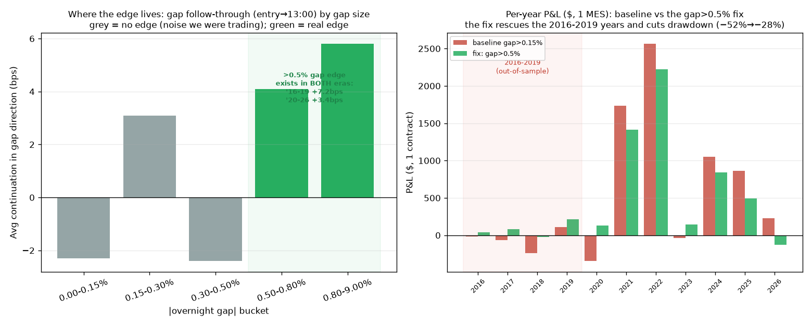

# MES Intraday — Why 2016-2019 Failed, and What We Were Missing

*Diagnostic follow-up to the [out-of-sample test](mes_intraday_exit_strategy_research.md#6-out-of-sample-test--2016-2019-the-edge-is-regime-conditional).
Same instrument proxy (SPY 5-min → MES, $5/pt), same account, same audited simulator. This report
answers the obvious question the OOS failure raised: **why** did gap-and-go make +23-47%/yr in
2020-2026 but roughly nothing in 2016-2019 — and is there anything to fix?*

**Author:** research agent · **Date:** 2026-07-02 · Reproduce:
`uv run python research/mes_intraday/diagnose_regime.py`

---

## 1. Executive summary

Three findings, each reproducible, that together explain the regime dependence **and** yield a
concrete improvement:

1. **The strategy is a *trend-day harvester*, not a volatility play.** Its profit comes from years
   with a strong sustained trend — 2021 was carried almost entirely by the **long** side (+$1,660,
   SPY +29%), 2022 almost entirely by the **short** side (+$1,950, SPY −20%). It bleeds in choppy or
   reversal years (2018 long −$537; 2020 short −$994 as COVID down-gaps got run over by the
   V-recovery). Volatility does *not* explain it: 2020 had the **highest** vol and lost; 2017 the
   **lowest** and lost.

2. **The edge lives entirely in *large* gaps (>0.5%) — and it exists in BOTH eras.** Measuring how
   far price actually travels from entry (~09:40) to the 13:00 exit *in the gap's direction*, by gap
   size: gaps below 0.5% are coin-flips with zero-to-negative expectancy; gaps above 0.5% continue
   ~54-55% of the time with a positive average. Critically, the large-gap edge is **+7.2 bps in
   2016-2019 and +3.4 bps in 2020-2026** — present, and if anything *stronger*, in the "bad" period.
   **The baseline strategy diluted a real large-gap edge with a flood of no-edge small-gap noise**,
   and that noise happened to net negative in the low-volatility 2016-2019 years.

3. **The fix — trade only meaningful gaps (>0.5%) — is a genuine, robust improvement.** It roughly
   **halves the max drawdown (−52% → −28%)**, makes the strategy **survivable on $2,000** (min equity
   $1,689 vs $1,043), turns the 2016-2019 out-of-sample window from **−2.7% to +3.9%**, and is
   profitable in **10 of 11 years** (only 2018 −$22 and partial-2026 −$128) — all while giving up
   almost nothing full-sample (+25.9% vs +27.9%) on **60% fewer trades** (362 vs 909).

**Honest bottom line:** we were missing selectivity — trading ~900 gaps when only the ~360 large
ones carried the edge. Fixing that makes the strategy *materially more robust and survivable*. But
it does **not** make it regime-*independent*: it is still a fat-tailed harvester whose big numbers
(+39% in 2020-2026) require big-trend years, and its out-of-sample return is a modest +3.9%. The fix
buys survivability and consistency, not immunity to a decade like 2016-2019.



---

## 2. Finding 1 — it's a trend-day harvester (volatility is a red herring)

Per-year P&L split into long vs short, with SPY's drift and daily volatility for context
(gap-and-go, ATR stop, 13:00 exit, 1 contract):

| Year | Long $ | Short $ | Total $ | SPY return | Daily vol | Read |
|---|---|---|---|---|---|---|
| 2016 | −57 | +38 | −19 | +11% | 0.82 | chop, flat |
| 2017 | +37 | −99 | −63 | +18% | **0.42** | low-vol grind, shorts bleed |
| 2018 | **−537** | +297 | −239 | −7% | 1.10 | topping/choppy, longs killed |
| 2019 | +273 | −165 | +109 | +29% | 0.79 | bull, longs win |
| 2020 | +649 | **−994** | −345 | +15% | **2.16** | COVID: down-gaps reverse, shorts crushed |
| 2021 | **+1,660** | +73 | +1,733 | +29% | 0.83 | strong bull → long trend-days |
| 2022 | +613 | **+1,950** | +2,563 | −20% | 1.52 | bear → short trend-days |
| 2023 | +106 | −145 | −39 | +25% | 0.83 | grind up but choppy intraday |
| 2024 | +885 | +163 | +1,048 | +24% | 0.79 | bull, longs win |
| 2025 | −130 | +995 | +865 | +17% | 1.17 | two-sided, shorts win |
| 2026 | +562 | −332 | +230 | +9% | 0.89 | partial year |

The winners are **trending years** where gaps align with the trend (2021 long, 2022 short, 2024
long, 2025 short). The losers are **choppy or reversal** years (2018, 2020, 2023) or **low-volatility
grinds with no follow-through** (2017). Note the two highest-volatility years split opposite ways
(2022 +$2,563, 2020 −$345) — so "trade when vol is high" is the wrong lesson, which is exactly why
the volatility-expansion filter I tested *hurt* out-of-sample.

---

## 3. Finding 2 — the edge is in large gaps, and it's stable across eras

For every day, measure the signed move from the entry area (~09:40) to the 13:00 exit **in the
gap's direction**, bucketed by gap size (pooled 2016-2026):

| \|gap\| | n | continued % | avg edge (bps) | median (bps) |
|---|---|---|---|---|
| 0.00-0.15% | 736 | 46.7 | **−2.3** | −1.5 |
| 0.15-0.30% | 609 | 49.3 | +3.1 | −0.3 |
| 0.30-0.50% | 527 | 48.6 | **−2.4** | −2.8 |
| **0.50-0.80%** | 396 | **54.3** | **+4.1** | +7.4 |
| **0.80%+** | 367 | **55.0** | **+5.8** | +10.9 |

Below 0.5% there is no edge — continuation is a coin flip and the average is around zero or negative.
Above 0.5% the gap genuinely tends to continue (~54-55%). And the split is **not** a 2020s artifact:

| Gap class | 2016-2019 | 2020-2026 |
|---|---|---|
| **\|gap\| > 0.5%** | 55.1% cont, **+7.2 bps** | 54.4% cont, **+3.4 bps** |
| \|gap\| < 0.3% | 49.2% cont, +0.4 bps | 46.9% cont, −0.1 bps |

**This reframes the whole OOS failure.** The genuine gap-continuation edge was *present and stable*
in 2016-2019 — the strategy failed there mostly because the baseline (any gap > 0.15%) buried that
edge under hundreds of no-edge small-gap trades, whose noise net-lost in the low-volatility years.
Economically it makes sense: a small overnight drift carries no information, but a >0.5% gap reflects
real repricing (earnings, macro, global news) that tends to keep going.

---

## 4. Finding 3 — the fix: trade only meaningful gaps (>0.5%)

| Variant | Full ann. | Full $ | Max DD | Min equity | Survives $2k? | OOS 2016-19 | DEV 2020-26 | Trades |
|---|---|---|---|---|---|---|---|---|
| Baseline gap>0.15% | +27.9% | $5,843 | **−52%** | $1,043 | **No** | **−2.7%** | +46.6% | 909 |
| **Fix: gap>0.5%** | +25.9% | $5,427 | **−28%** | **$1,689** | **Yes** | **+3.9%** | +39.4% | 362 |

Per-year, the fix (green in the chart) turns the 2016-2019 red bars to (mostly) green and trims the
disasters: 2018 goes −$239 → −$22, 2020 −$345 → +$128, while keeping the 2021/2022 home runs. Only
**2 of 11 years** are negative (2018 −$22, partial-2026 −$128). The threshold is a **plateau** — 0.4%,
0.5% and 0.6% all give ~+22-26% full-sample with ~−28% drawdown — so it is not a knife-edge tuned
point. The trade count drops 60% (fewer, higher-conviction trades → lower cost drag).

---

## 5. What this does and doesn't fix (honest limits)

- **Fixed:** the strategy is now *survivable* on $2,000, its drawdown is halved, and its
  out-of-sample return is positive rather than negative. Most of the apparent regime fragility was
  self-inflicted (trading noise) and is gone.
- **Not fixed:** it is still a **fat-tailed trend-day harvester**. Its large numbers come from
  big-trend years (2021, 2022); the OOS 2016-2019 return, though now positive, is a modest **+3.9%**.
  If the next four years look like 2016-2019 (low-vol grind, no big trends), the selective version
  makes low-single-digits, not 20-40%. The fix buys robustness, not a guarantee.
- **Mild in-sample influence:** the 0.5% threshold was chosen partly with knowledge of the full
  sample. Mitigations: it is a plateau, the per-*trade* edge is measured directly (not fit to P&L),
  and that edge is positive in both eras independently. Read "+25.9% full / +3.9% OOS" as directional,
  not a promise.
- **Proxy + fills** caveats from the prior reports still apply (SPY-as-MES; the gap entry touches the
  open where the proxy is least exact; confirm on real MES bars and the internal engine).

---

## 6. What to try next

1. **Adopt gap>0.5% as the default** — it is strictly more robust and survivable than the baseline at
   almost no full-sample cost. This is the concrete improvement from this study.
2. **Add a complementary chop-regime strategy.** The gap harvester is idle/again-flat in low-trend
   years; a mean-reversion sleeve that profits in exactly those years (2016, 2017, 2023) would smooth
   the equity curve. The two are negatively correlated by construction.
3. **Size by conviction.** Since edge rises with gap size (bps climb from +4 to +6 across the >0.5%
   buckets), scaling contracts with gap size (on a large enough account) should raise risk-adjusted
   return — but only where margin allows (see the [$5k sizing analysis](mes_intraday_exit_strategy_research.md#5-what-a-larger-account-buys--5000-and-10000-sizing)).
4. **Do not expect 2020-2026 returns going forward** without those big-trend years. The defensible
   expectation for the selective version is low-double-digit annualized *across* regimes, spiking in
   trending years — a survivable, honest edge, not a 40%/yr engine.

---

## 7. Files & rerun

**New:** `research/mes_intraday/diagnose_regime.py`, `research/mes_intraday/make_regime_chart.py`,
`research/results/mes_regime_diagnosis.json`, `research/charts/mes_regime_diagnosis.png`, this report.

```bash
uv run python research/mes_intraday/diagnose_regime.py
uv run python research/mes_intraday/make_regime_chart.py
```

*Reuses the existing simulator/engine unchanged. All outputs are sanitized aggregates; `.data/`
stays gitignored. Nothing here is financial advice.*
