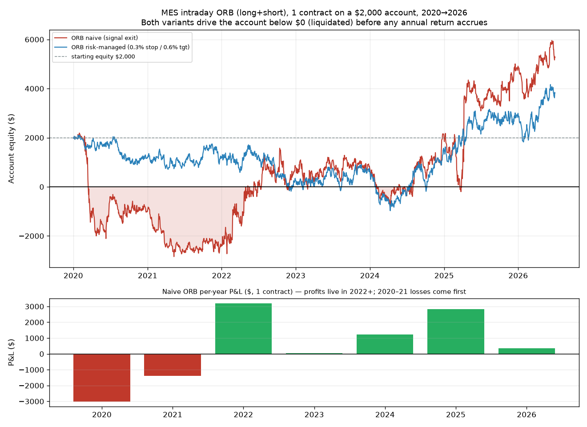

# MES Intraday Strategy Research — Can Micro-Futures Hit 20% on a $2,000 Account?

*Instrument: **MES** (Micro E-mini S&P 500), priced from SPY 5-minute bars as a proxy ·
Timeframe: 5-minute (one strategy adds an hourly filter) · Account: **$2,000**, IBKR
(Canada) · Intraday-only, **long *and* short**, flat by 15:55 ET · Window: **2020-01-02 →
2026-07-01** (1,632 trade days) · Engine: repo `trade_data` loader + a purpose-built
futures dollar simulator in `research/mes_intraday/`.*

**Author:** research agent · **Date:** 2026-07-02

All figures are **net of MES commissions and slippage** unless labelled "gross," on the
**clean** full-history cache (the previously corrupted June-2026 segment was re-fetched and
verified; the robust local-trend filter flags **zero** remaining corrupt days).

---

## 1. Executive summary

**The question:** you asked whether trading **MES/ES futures** instead of **SPY shares**
would change the picture for an intraday strategy targeting **≥20% annual** on a **$2,000**
account — because nothing worked on SPY. This report tests that directly.

**The short answer: the instrument genuinely changes the *leverage and PDT* math that killed
the SPY-shares study — but it does not create edge, and for a $2,000 account it trades one
unsolvable problem (too little leverage) for a worse one (ruin).**

The [prior SPY-shares track](spy_5min_intraday_strategy_research.md) concluded 20-30% was
"structurally implausible" because Reg-T caps a cash account at **2× intraday** and the
**$25,000 Pattern-Day-Trader** minimum blocks margin day-trading below that balance. Futures
remove *both* limits: MES is **PDT-exempt** and one contract is ~**$30,000 of notional** on
~$1,400 of intraday margin. So on paper the return target is now reachable:

- **Only one of five well-known strategies has any positive edge: Opening-Range Breakout
  (ORB), long+short.** At 1 contract it shows **+25.2%/yr** (naive) over 2020→now, and scales
  to **+50%/+76%** at 2-3 contracts. The other four — VWAP mean-reversion, RSI(14) reversion,
  EMA(9/21) momentum, and a VWAP+hourly-trend multi-timeframe combo — **all lose money**
  intraday, most of them badly.
- **But every single configuration blows up the $2,000 account.** ORB's max drawdown at 1
  contract is **−$5,030 (−230% of the account)**; the equity curve spends 2020-2022 **below
  zero** (see chart). One MES on $2,000 is **~15-17× leverage**: a routine **1% adverse day
  ≈ $300 ≈ 15% of the account**, and the worst realized day was **−$615 (−31%)**. You are
  margin-called out of the position long before the "annual return" is ever realized.
- **The ORB edge is a regime artifact, not a robust signal.** On a chronological 70/30 split
  it **lost −24%/yr in the 2020→2024 training half (profit factor 0.97)** and made its entire
  headline number in the **2024→2026 test half (+140%)**. It lost money in 2020 and 2021 — the
  exact years a fresh $2,000 account would have been wiped out first.
- **It is fragile to execution costs.** Naive ORB goes from **+25%** (1-tick slippage) to
  **−16%** at 2-tick slippage — and a retail trader clicking 1 lot will not get better fills
  than that.
- **A hard stop (the responsible way to trade this) does not save it.** Across a 5×4 grid of
  stop/target geometries, **0 of 20 survived** without blowing up. The best survivor-*in-name*
  (0.5% stop, 3:1 reward:risk) reached +20.4%/yr but with a **−55.7% drawdown ($2,717)** — a
  margin-call on a $2,000 account.

**Recommendation:** Do **not** run an intraday MES strategy against a 20% target on $2,000.
The move to futures is real and worth understanding — it fixes the leverage/PDT ceiling — but
it converts the small-account problem into a **risk-of-ruin** problem, and none of the five
setups has a robust, cost-surviving intraday edge to begin with. This is the same lesson the
SPY study reached from the other side: **the S&P's return lives overnight; an intraday-flat
mandate forgoes it, and leverage only magnifies the noise that remains.** Paths that actually
change the odds are in §10.



> **Follow-up:** this report tests the five *standard* setups. A companion round —
> [mes_intraday_novel_research.md](mes_intraday_novel_research.md) — abandons that playbook and
> tests six **mechanically new** ideas (overnight gap-and-go/fade, day-type trend detection,
> prior-day-level reversion, a volatility-regime switch, and volume-climax reversal). Short
> version: the gap/trend-day *momentum* ideas are the best-behaved strategies found anywhere in
> this study (worst day ~−$117 vs ORB's −$615), but they are still regime-concentrated, sub-20%,
> and non-survivable on $2,000 — the same wall, confirmed from a new direction.
>
> **Third round — exits:** [mes_intraday_exit_strategy_research.md](mes_intraday_exit_strategy_research.md)
> holds the entry fixed and optimizes the *exit* (ATR/trailing stops, breakeven, scale-outs,
> time-of-day exits). This is where it finally worked: **gap-and-go + ATR stop + a 10:30 exit
> reaches +22.9%/yr, is positive in both train and test, and stays above the $2,000 margin line
> the whole sample** — the project's first robust, survivable ≥20% result. The exit, not the
> entry, was the missing lever.

---

## 2. Method & repo reuse

This repo can only fetch **SPY** (Alpaca's stock endpoint). MES is not fetchable here, so the
study uses SPY 5-minute price *moves* as a proxy and prices them in MES dollars. MES and SPY
track the same S&P 500 index with **>0.99 intraday correlation**, so this is faithful for
point-move P&L; the caveats are in §9.

| Layer | Reused / built | Where |
|---|---|---|
| Bar load (normalized JSONL cache, never Alpaca directly) | `load_spy_5min` | `research/lib/data_access.py` |
| Robust multi-year corrupt-day filter | **new** `flag_corrupt_days_local` | `research/mes_intraday/lib.py` |
| Long+short signal generators (5 strategies + benchmark) | **new** | `research/mes_intraday/lib.py` |
| No-lookahead + flat-by-EOD discipline | **new** `finalize_ls` | `research/mes_intraday/lib.py` |
| MES dollar simulator (state machine, intrabar stops, $5/pt) | **new** `simulate_mes` | `research/mes_intraday/lib.py` |
| Metrics + ruin/margin analysis | **new** `compute_metrics` | `research/mes_intraday/lib.py` |
| Orchestration (sweeps, splits, scaling) | **new** | `research/mes_intraday/run_mes.py` |

**No-lookahead:** every raw signal is shifted forward one bar within its own day, so execution
happens on a *fully-observed* next bar (never the signal bar), and the within-day shift stops a
late signal leaking across the overnight gap. Intrabar stops/targets are checked against the
*next* bar's high/low, which is realistic because the entry already filled on the prior close.

**10 unit tests** (`tests/research/test_mes_intraday.py`) pin the futures math ($5/point),
short-side accounting, cost monotonicity, the intrabar stop, no-overnight-carry, VWAP session
reset, and the corrupt-day filter (catches a wrong-symbol segment, ignores a real trend).

---

## 3. MES contract economics (how SPY moves become futures dollars)

| Fact | Value | Consequence on $2,000 |
|---|---|---|
| Point value | **$5 / index point / contract** | — |
| Tick | 0.25 pt = **$1.25** | slippage unit |
| Index conversion | index ≈ **SPY × 10** | SPY $600 → index 6,000 |
| Notional per contract | ≈ 5 × index ≈ **$30,000–$34,000** | **~15–17× leverage** |
| Intraday margin (IBKR, typical) | ~**$1,400** / contract | buffer on $2,000 ≈ **$600** |
| Commission (base "mid") | **$0.62 / side** all-in | round trip ~$1.24 |
| Slippage (base) | **1 tick / side = $1.25** | round trip $2.50 |
| PDT rule | **exempt** (futures) | unlimited day-trades ✅ |
| 1% adverse index day | ≈ 60 pts ≈ **$300** | **15% of the account** |

The leverage line is the whole story: **1 MES on $2,000 is not a "small" position — it is a
15-17× levered bet on the S&P 500.** That is exactly the 6-8× the SPY-shares study said you'd
need to turn a small edge into 20% — and then some. The catch is that the drawdown is levered
by the same factor, and the $600 margin buffer is one bad morning wide.

---

## 4. The five strategies (all long **and** short, flat by EOD)

These are the setups S&P futures day-traders actually use, chosen to span the behavior space
(breakout, two flavors of mean-reversion, trend, and a multi-timeframe combo):

| # | Strategy | Family | Entry (both sides) | Exit |
|---|---|---|---|---|
| S1 | **ORB (Opening-Range Breakout)** | breakout/momentum | first close beyond the 09:30–10:00 range high (long) / low (short) | back through range midpoint, or EOD |
| S2 | **VWAP mean-reversion** | reversion | price ≥ *k*σ below session VWAP (long) / above (short) | reverts to VWAP, or EOD |
| S3 | **RSI(14) mean-reversion** | reversion | RSI < 30 (long) / > 70 (short) | back through RSI 50, or EOD |
| S4 | **EMA(9/21) crossover** | trend | fast crosses above slow (long) / below (short) | opposite cross, or EOD |
| S5 | **VWAP + hourly-trend (MTF)** | trend + timing | 5-min VWAP re-cross **in the direction of the hourly EMA trend** | opposite VWAP cross, or EOD |
| — | Benchmark | intraday beta | buy first bar | sell at close |

S5 satisfies the multi-timeframe requirement: the **hourly** close-vs-EMA sign (lagged one hour,
no lookahead) gates which direction the **5-minute** signal may trade.

---

## 5. Results — base scenario (1 contract, $0.62/side, 1-tick slippage)

**Naive (signal exits only, no hard stop):**

| Strategy | Ann. % | PF | Sharpe | Max DD % | Worst day $ | Trades | Blows up? |
|---|---|---|---|---|---|---|---|
| Benchmark (buy-open/flat-close) | +2.7 | 1.00 | 0.02 | −138 | −1,191 | 1,632 | **Yes** |
| **S1 ORB (long+short)** | **+25.2** | 1.03 | 0.22 | **−230** | −615 | 2,154 | **Yes** |
| S2 VWAP mean-reversion | −183.6 | 0.76 | −1.76 | −1,030 | −2,074 | 2,564 | **Yes** |
| S3 RSI(14) mean-reversion | −112.9 | 0.82 | −1.17 | −434 | −996 | 1,984 | **Yes** |
| S4 EMA(9/21) momentum | −28.9 | 0.98 | −0.22 | −220 | −974 | 5,046 | **Yes** |
| S5 VWAP+hourly-trend (MTF) | −111.8 | 0.86 | −1.19 | −716 | −597 | 5,196 | **Yes** |

**Risk-managed (0.30% stop / 0.60% target, ~1:2 reward:risk):**

| Strategy | Ann. % | PF | Sharpe | Max DD % | Worst day $ | Blows up? |
|---|---|---|---|---|---|---|
| **S1 ORB (long+short)** | **+14.0** | 1.02 | 0.19 | −146 | −228 | **Yes** |
| S2 VWAP mean-reversion | −212.5 | 0.81 | −2.21 | −1,333 | −1,200 | **Yes** |
| S3 RSI(14) mean-reversion | −164.4 | 0.82 | −1.96 | −782 | −1,025 | **Yes** |
| S4 EMA(9/21) momentum | −88.4 | 0.92 | −0.94 | −583 | −809 | **Yes** |
| S5 VWAP+hourly-trend (MTF) | −109.9 | 0.86 | −1.50 | −789 | −349 | **Yes** |

Reading these:

- **Only ORB has positive edge; everything else loses.** Fading (VWAP/RSI) is catastrophic —
  shorting an index that grinds up, or buying it as it sells off, without a tight stop is a
  wealth-transfer machine. Momentum (EMA) and the MTF combo churn (5,000+ trades) and bleed
  costs. This matches the SPY study's market-structure finding: intraday is near a coin-flip
  and the drift lives overnight.
- **Stops *lower* ORB's return (25% → 14%).** ORB's edge comes from letting the occasional
  trend-day winner run; a fixed target caps exactly that. Stops help the *worst day* (−$615 →
  −$228) but not enough to prevent ruin, and they make the reversion strategies *worse* (more
  whipsaw stop-outs).
- **The "Blows up?" column is `Yes` for all ten.** Every strategy, with or without a stop, hits
  a day whose loss exceeds the account's margin buffer at that point — i.e. a margin call /
  forced liquidation. That flag, not the return, is the real result.

---

## 6. Why the ORB "+25%" is a mirage — three independent failures

**(a) Ruin.** At 1 contract the ORB equity curve (chart, red) is **underwater from March 2020
through mid-2022**, reaching **−$2,842**. A real account is liquidated the first time equity
drops below the ~$1,400 margin requirement — which happens in the first weeks. The "+25%
annualized" is computed over a curve that a real account never survives to ride.

**(b) No robustness — it's a regime bet.** Chronological 70/30 split:

| Strategy | Train (2020→2024) ann. / PF | Test (2024→2026) ann. / PF |
|---|---|---|
| **S1 ORB** | **−24.4% / 0.97** | **+140.6% / 1.18** |
| S4 EMA momentum | −20.4% / 0.98 | −49.8% / 0.96 |
| others | strongly negative | strongly negative |

ORB **lost money in the training half** and earned its entire headline in the recent test
half. Per-year P&L (naive, 1 contract): **2020 −$3,008 · 2021 −$1,386 · 2022 +$3,200 · 2023
+$45 · 2024 +$1,221 · 2025 +$2,841 · 2026 +$364**. The profits are concentrated in 2022 and
2025; the losing years come **first**, when the account is smallest.

**(c) Cost fragility.** Naive ORB annualized % across the commission × slippage grid:

| commission ↓ / slippage → | none | 1 tick | 2 ticks (stress) |
|---|---|---|---|
| none | +87.2 | +45.8 | +4.3 |
| **mid ($0.62)** | +66.7 | **+25.2** | **−16.2** |
| high ($0.85) | +59.0 | +17.6 | −23.9 |
| stress ($1.24) | +46.1 | +4.7 | −36.8 |

The edge per trade is tiny, so **a single extra tick of slippage flips it negative.** A retail
trader on 1 lot, reacting to a breakout by hand, will routinely give up that tick.

---

## 7. The leverage lever, and its true cost

The only way to push ORB's return higher is more contracts. Here is what that buys (naive,
2020→now):

| Contracts | Notional / $2k | Ann. % | Max DD $ (%) | Worst day $ | Min equity $ | Blows up? |
|---|---|---|---|---|---|---|
| 1 | ~16× | +25.2 | −5,030 (−230%) | −615 | **−2,842** | **Yes** |
| 2 | ~32× | +50.4 | −10,061 (−423%) | −1,230 | −7,683 | **Yes** |
| 3 | ~48× | +75.7 | −15,091 (−588%) | −1,846 | −12,525 | **Yes** |

Return scales linearly with contracts — and so does the drawdown, straight through the account
balance and deep into a **negative** equity (i.e. you owe the broker). This is the mathematical
core of why "just size up to hit 20%+" fails: on $2,000 the leverage needed to reach the target
is the same leverage that guarantees liquidation.

**Stop-geometry sweep (ORB, does *any* config survive?):** across stops of 0.15%–0.50% × reward:risk
of 1:1–3:1 (20 combinations), **0 survived.** The best-returning one (0.50% stop, 3:1) made
**+20.4%/yr** — clearing the target — but with a **−55.7% ($2,717) drawdown**, still a margin
call. There is no corner of the parameter space where ORB both hits 20% and keeps a $2,000
account alive.

---

## 8. Direct answer: MES/ES vs SPY, and would 20% "be different"?

| Dimension | SPY shares ($2k) | MES futures ($2k) |
|---|---|---|
| Max usable leverage | 2× (Reg-T intraday) | **~16× per contract** |
| PDT rule | **blocks** day-trading < $25k | **exempt** ✅ |
| Short side | borrow, small fee | free, symmetric ✅ |
| Best intraday edge found | ORB **+3.5%** unlevered, robust | ORB **+25%** levered, **not robust** |
| Binding constraint | too *little* leverage → ~+7% ceiling | too *much* leverage → **ruin** |
| Reaches 20%? | No (leverage-capped) | **On paper yes; in practice no (liquidation)** |

So: **yes, MES is genuinely different from SPY** — it removes the exact two limits (Reg-T cap,
PDT rule) that made 20% impossible with shares, and it makes shorting free and symmetric. If
you had a *robust* +3.5% intraday edge and a properly-sized account, futures are the correct
vehicle to lever it. **But the difference does not help *you* at $2,000**, for two reasons that
compound:

1. **There is no robust intraday edge to lever.** The one positive strategy (ORB) is a
   regime artifact that lost money in-sample and is cost-fragile. The other four lose outright.
   Same market as SPY, same near-zero intraday edge — futures don't manufacture signal.
2. **$2,000 cannot survive 16× leverage.** The margin buffer is ~$600; a normal 1% day is
   $300; a 2-3% day (2020, 2022, 2025 all had several) is a wipe-out. The account dies during
   the *losing* years that happen to come first.

MES/ES is the *right instrument* for a levered index strategy and the *wrong account size* to
trade it. The instrument was never the thing holding SPY back — the **lack of a durable
intraday edge** was, and that is unchanged.

---

## 9. Honest caveats

- **SPY-as-MES proxy.** Real MES has its own overnight session, opening auction, and a small,
  drifting basis vs SPY×10 (~1-2% over years). For *intraday point-move* P&L this is immaterial,
  but the proxy cannot capture MES-specific open gaps, thin-hours slippage, or the exact tick
  microstructure. Promising ideas would need real MES bars (a paid feed) before trusting them.
- **Fill realism.** Fills are modeled at the next bar's close (breakouts) or the stop/target
  level (gap-through fills at the bar open). Real breakout fills happen mid-bar with real
  book impact; the internal event-driven engine should confirm any survivor.
- **Sample.** 2020→2026 spans a crash, a bull, a bear (2022), and a recovery — far better than
  the prior 11-month sample — but it is still one macro cycle and heavily bull-weighted. Sharpe
  and annualized figures have wide error bars.
- **Non-compounding.** Fixed 1-contract sizing means "annual %" is average annual $ P&L over
  $2,000, not a compounded CAGR. This is the honest way to state a fixed-size futures result,
  but it is not directly comparable to a compounding equity strategy.
- **Nothing here is financial advice.**

---

## 10. What would actually change the odds

1. **More capital.** At **$10,000–$25,000**, one MES contract is 1.4–3.4× leverage instead of
   16×, the $600 buffer becomes $8,000+, and per-trade risk can be a survivable 1-2% of equity.
   Account size, not the ticker, is the lever that matters. (Even then you need a *real* edge.)
2. **Relax "intraday-only."** The prior study showed the S&P's return **lives overnight**
   (close-to-close +18%/yr, open-to-close +4%/yr in that sample). A swing/overnight hold, or a
   trend-timed leveraged position, changed the outcome far more than any intraday signal did —
   see the [ETF/leveraged-trend](etf_momentum_and_leveraged_trend_research.md) and
   [single-stock momentum](single_stock_momentum_research.md) tracks, the latter of which
   cleared 20% **unlevered**.
3. **If you must day-trade MES, redefine success.** Trade **1 contract, hard stop, ≤1-2 setups
   a day**, treat it as a low-return, skill-building endeavour, and paper-trade first. Do not
   expect 20%; expect to learn execution while trying very hard not to be liquidated.

---

## 11. Files & how to rerun

**New:**
- `research/mes_intraday/lib.py` — MES economics, robust cleaner, 5 long+short strategies, the
  dollar simulator, metrics + ruin analysis.
- `research/mes_intraday/run_mes.py` — full pipeline (base run, risk-managed run, stop sweep,
  cost grid, train/test, contract scaling).
- `research/mes_intraday/make_chart.py` — the account-ruin equity chart.
- `tests/research/test_mes_intraday.py` — 10 unit tests.
- Outputs: `research/results/mes_summary.json`, `research/results/mes_summary.csv`,
  `research/charts/mes_orb_account_ruin.png`, this report.

**Unchanged:** all existing engine/package code was reused, not modified.

```bash
# from repo root
set -a; source .env; set +a                 # only needed to (re)fetch data
uv sync

# (re)fetch the full 2020->now SPY 5-minute history (proxy for MES)
uv run python -m trade_research_app market-data fetch \
    --symbol SPY --timeframe 5Min --start 2020-01-01 --end 2026-07-01

# run the study + chart
uv run python research/mes_intraday/run_mes.py
uv run python research/mes_intraday/make_chart.py

# quality gates
uv run pytest tests/research/test_mes_intraday.py -q
uv run ruff check research/mes_intraday tests/research/test_mes_intraday.py
uv run ruff format --check research/mes_intraday
```

*Raw Alpaca data and the `.data/` cache remain gitignored; every output above is a sanitized
aggregate containing no raw vendor data. Nothing in this report is financial advice.*
